<p align="center">
  
</p>

<p align="center">
  
  
  
  
</p>

## hey, i'm gievano.

I learn by building small things I actually want to use. They usually start out messy, so I use AI to get a rough version running, then poke through the code until it makes sense to me.

```text
right now

learning    python fundamentals
making      scripts for repetitive stuff
workflow    vibecoding, then figuring out why it works
background  visual communication design
```

### lately

Still working through the basics and testing what I learn in small scripts. My design background sneaks into the result.

### selected work

- [`luap-snake`](https://github.com/gievano/luap-snake) — Snake in one HTML file, with five visual worlds.
- [`map-voice`](https://github.com/gievano/map-voice) — A Roblox project where I build and test gameplay systems in Luau.

<details open>
<summary><strong>stats &amp; activity</strong></summary>

### streak

<p align="center">
  <picture>
    <source media="(prefers-color-scheme: dark)" srcset="https://streak-stats.demolab.com?user=gievano&amp;theme=dark&amp;hide_border=true&amp;ring=FFFFFF&amp;fire=FFFFFF&amp;currStreakLabel=FFFFFF" />
    
  </picture>
</p>

### profile

<p align="center">
  <picture>
    <source media="(prefers-color-scheme: dark)" srcset="https://github-stats-extended.vercel.app/api?username=gievano&amp;show_icons=true&amp;hide_border=true&amp;bg_color=0D1117&amp;title_color=FFFFFF&amp;text_color=FFFFFF&amp;icon_color=FFFFFF" />
    
  </picture>
  <picture>
    <source media="(prefers-color-scheme: dark)" srcset="https://wsrv.nl/?url=https%3A%2F%2Fgithub-stats-extended.vercel.app%2Fapi%2Ftop-langs%3Fusername%3Dgievano%26layout%3Dcompact%26hide_border%3Dtrue%26bg_color%3D0D1117%26title_color%3DFFFFFF%26text_color%3DFFFFFF&amp;filt=greyscale&amp;output=png&amp;maxage=1d" />
    
  </picture>
</p>

<sub>Language percentages come from public repositories. They don't measure skill.</sub>

### contributions

<picture>
  <source media="(prefers-color-scheme: dark)" srcset="https://github-readme-activity-graph.vercel.app/graph?username=gievano&amp;bg_color=0D1117&amp;color=FFFFFF&amp;line=FFFFFF&amp;point=FFFFFF&amp;area_color=FFFFFF&amp;hide_border=true&amp;custom_title=Gievano%27s%20Contribution%20Graph" />
  
</picture>

</details>
